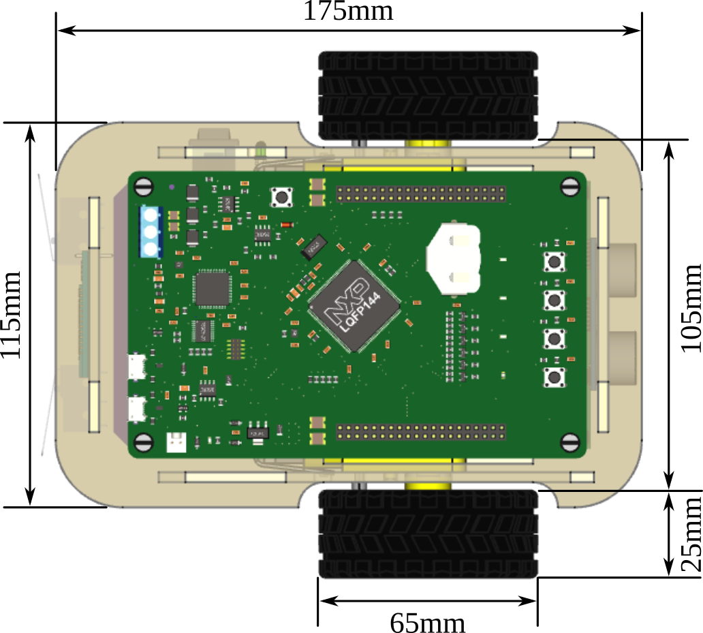

# Principales características

## Componentes

  * Motorreductor de corriente continua (6-9V) 48:1 (x2)
  * Sensor óptico TCST2103 (tacómetro) (x2)
  * Sensor reflectivo TCRT5000 (detección de línea) (x2)
  * Micro llave de detección de colisiones (paragolpes) (x2)
  * Sensor de distancia por ultrasonido HC-SR04 (sonar)
  * Módulo Bluetooth HC-05
  * Módulo cargador y fuente step-up (5V-2A)
  * Baterías de Li-Ion 18650 (2200mAh) (x2)

## Dimensiones

La siguiente figura muestra las cotas de la vista superior del robot.

La siguiente tabla muestra las dimensiones del robot.

|                        |                                                 |
|------------------------|-------------------------------------------------|
| Dimensiones            | Largo: 175 mm Ancho: 115 mm Altura: 55 mm |
| Diámetro de las ruedas | 65 mm                                           |
| Distancia entre ruedas | 130 mm                                          |
| Despeje del suelo      | 10 mm                                           |
|                        |                                                 |

