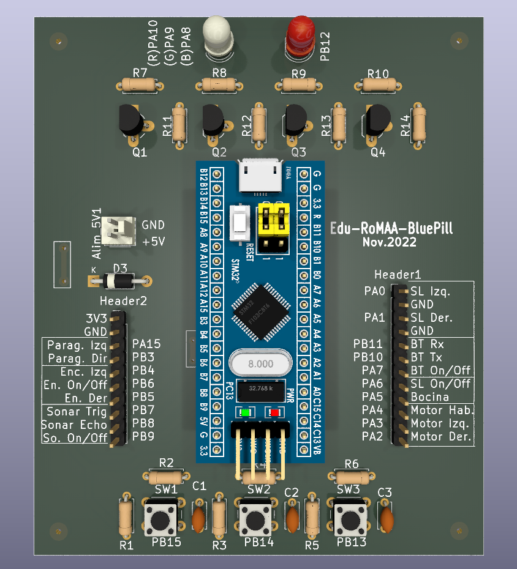

# Placa de adaptación para BluePill

Es un placa para adaptar el conexionado del EduRoMAA con la placa de desarrollo BluePill.

## Características

* 3 pulsadores de propositos generales.

* 1 Led RGB.

* 1 Led rojo.

* 2 conectores para la utilización con el EduRoMAA.

* 1 conector para entrada de alimentación de 5V.

#### Asignación de pines de la BluePill

| Componente      | Pin BluePill | Periferico |
| --------------- |:------------:| ---------- |
| SW1             | PB15         |            |
| SW2             | PB14         |            |
| SW3             | PB13         |            |
| LED RGB (Red)   | PA10         |            |
| LED RGB (Green) | PA9          |            |
| LED RGB (Blue)  | PA8          |            |
| LED Red         | PB12         |            |

##### Header 1 - conector con EduRoMAA

| Pin Conector | Componente EduRoMAA | Pin BluePill |     |
|:------------:| ------------------- |:------------:| --- |
| 1            | 3.3v                | 3.3          |     |
| 2            | GND                 | G            |     |
| 3            | Paragolpe Izquiero  | PA15         |     |
| 4            | Paragolpe Derecho   | PB3          |     |
| 5            | Encoder Izquierdo   | PB4          |     |
| 6            | Enconder on/off     | PB6          |     |
| 7            | Encoder Derecho     | PB5          |     |
| 8            | Sonar Trigger       | PB7          |     |
| 9            | Sonar Echo          | PB8          |     |
| 10           | Sonar on/off        | PB9          |     |

##### Header 2 - conector con EduRoMAA

| Pin Conector | Componente                  | Pin BluePill |     |
|:------------:| --------------------------- |:------------:| --- |
| 1            | Seguidor de Linea Izquierdo | PA0          |     |
| 2            | GND                         | G            |     |
| 3            | Seguidor de Linea Derecho   | PA1          |     |
| 4            | GND                         | G            |     |
| 5            | BlueTooth Rx                | PB11         |     |
| 6            | BlueTooth Tx                | PB10         |     |
| 7            | BlueTooth on/off            | PA7          |     |
| 8            | Seguidor de Linea on/off    | PA6          |     |
| 9            | Bocina                      | PA5          |     |
| 10           | Habilitación Motor          | PA4          |     |
| 11           | Motor Izquierdo             | PA3          |     |
| 12           | Motor Derecho               | PA2          |     |
